**Last Updated:** `r Sys.Date()`


```{r setup, include=FALSE}
knitr::opts_chunk$set(echo = TRUE)

# use this for the the README.md
GPbase <- "https://eriqande.github.io/thompson-et-al-2020-chinook-salmon-migration-timing/"

# use this for making the README.html that we will hard link to docs/index.html
Dbase <- "./"

# choose the one that you want here depending on if you are on the
# GitHub README or are making an index.html for the docs directory
hdir <- GPbase

make_link <- function(Rmd, base = hdir) {
  nb <- stringr::str_replace(Rmd, "Rmd$", "html")
  sprintf("%s\n\n(_Compiled RMarkdown HTML document on GitHub Pages:_ [%s](%s%s))\n\n", Rmd, nb, base, nb)
}
```

[](https://zenodo.org/badge/latestdoi/263405637)


This repository includes code, data, and some intermediate results to
reproduce the results in Thompson et al. ("A complex phenotype in salmon
controlled by a simple change in migratory timing").
You can get the whole thing by cloning or downloading the repo from 
[https://github.com/eriqande/thompson-et-al-2020-chinook-salmon-migration-timing](https://github.com/eriqande/thompson-et-al-2020-chinook-salmon-migration-timing).

If you are viewing this as the README of a GitHub repository, note that
you can read it in a somewhat friendlier format (i.e., with a table
of contents, etc.) on GitHub pages at:
[https://eriqande.github.io/thompson-et-al-2020-chinook-salmon-migration-timing/](https://eriqande.github.io/thompson-et-al-2020-chinook-salmon-migration-timing/)


For the whole-genome resequencing data, the production of BAMs and VCFs from the original FASTQ files follows a
standard bwa/GATK pipeline as described in the supplemental methods.  Here we focus on analyses
of the products of that work.  The various steps are described in a series of RMarkdown documents with a 
fair bit of explanation/description of the procedures.  Analyses requiring the use
of cluster computing resources are described and documented, but will not be run automatically
by evaluating the RMarkdown document.  Implementing them yourself will
require modification for the vagaries of your own high performance computing system and
preferred mode of parallelization, etc.  Running some of the RMarkdown documents requires
a proper shell.  These were run on a Mac.

Rmarkdown documents in the 000 series were developed primarily by Eric C. Anderson.
Rmarkdown documents in the 100 series were developed primarily by Neil F. Thompson.
Rmarkdown documents in the 200 series were developed primarily by Eric C. Anderson and deal
with further analyses done to respond to several reviewer queries.


In most cases, products from cluster computing are placed in this repository within
the `stored_results` directory.  This means that all the RMarkdown documents can be
evaluated successfully without first running the cluster-based analyses, except for
`002-allele-frequencies.Rmd`, for which the products from the cluster-based analyses
require too much space to store in this repository. Fortunately, none of the downstream analyses depend upon
the outputs from `002-allele-frequencies.Rmd`.  

All the RMarkdown documents can be evaluated en masse (except for `002-allele-frequencies.Rmd`) by
sourcing the R script `render-numbered-Rmds.R`.  On a fairly old mac laptop the run times
for each are as follows. Note that this does not include the time required to create the
stored results on the cluster, etc.

Rmarkdown document  | Run time
------------------- | ---------
001-align-coho-genome.Rmd | 1.7 secs
002-allele-frequencies.Rmd (after running initial results on cluster) | 3.3 mins
003-extract-johnson-creek-variants.Rmd | 8.7 mins
004-prepare-haplotypes.Rmd | 11.2 mins
005-annotating-variants-near-greb1l.Rmd | 5.9 mins
006-haplo-raster-plots.Rmd | 1.2 mins
007-arg-inference-and-plotting.Rmd | 4.9 mins
008-read-depths-and-duplications.Rmd | 41.2 secs
009-rosa-dna-distance-trees.Rmd | 2.3 mins
010-salmon-river-carcasses.Rmd | 48.2 secs
011-recombinant-frequencies.Rmd | 1.5 mins
012-coalescent-modeling-of-recombinants.Rmd | 3.5 mins
100-RoSA-figure1-map-using-sf.Rmd | 16.4 secs
101-Klamath-estuary-GSI-rubias.Rmd | 18.0 secs
102-Klamath-estuary-ANOVA-sampling-date-RoSA.Rmd | 11.0 secs
102.1-Klamath-estuary-partial-correlation.Rmd  | 1.6 secs
103-Klamath-estuary-GonadSI-mixed-model-analysis.Rmd | 3.3 secs
103.1-Klamath-estuary-GonadSI-power-analysis.Rmd | 1.4 mins
104-Klamath-estuary-nonwaterfraction-adiposity-mixed-model-analysis.Rmd | 2.1 secs
104.1-Klamath-estuary-nonwaterfraction-power-analysis.Rmd | 1.7 mins
105-Klamath-estuary-figure4.Rmd | 7.7 secs
106-TrinityRiver-ANOVA-etc.Rmd | 9.5 secs
107-RoSA-population-genetics-survey.Rmd | 1.6 secs
108-Klamath-basin-early-RoSA-haplotype-abundance-commercial-fishery-model-tableS10.Rmd | 1.2 secs
201-01-prep-bams-to-seek-inversions.Rmd  |  0.16 secs
201-02-seek-inversions.Rmd  |  3.7 mins
201-03-seek-inversions-with-gridss.Rmd  |  4.0 secs
202-01-genomewide-allele-freqs-from-the-bams.Rmd  |  4.7 secs
203-01-pca-for-gwas-covariate.Rmd  |  4.7 secs
203-02-gwas-with-angsd.Rmd  |  4.4 mins
204-01-assess-genotyping-error-rate-with-whoa.Rmd  |  1.2 mins
204-02-assess-genotype-error-from-subsampled-hi-read-depth-samples.Rmd  |  2.0 mins
204-03-simulate-imputation-and-phasing-error-for-trees.Rmd  |  6.7 mins


# Preliminaries and Dependencies

Below is a description of the needed dependencies.  A script to install all of
them on one of our test clusters is at `000-00-prepare-dependencies.sh`, but it will
likely need some tweaking on your system.

## Genomes, etc.
Download the necessary Chinook and coho
genomes and put them in a new directory called `genome` in this repository.
Index them with samtools faidx.
```sh
mkdir genome
cd genome

# coho genome
wget ftp://ftp.ncbi.nlm.nih.gov/genomes/all/GCF/002/021/735/GCF_002021735.1_Okis_V1/GCF_002021735.1_Okis_V1_genomic.fna.gz
mv GCF_002021735.1_Okis_V1_genomic.fna.gz Okis_V1_genomic.fna.gz
gunzip Okis_V1_genomic.fna.gz 
samtools faidx Okis_V1_genomic.fna


# chinook genome
wget ftp://ftp.ncbi.nlm.nih.gov/genomes/all/GCF/002/872/995/GCF_002872995.1_Otsh_v1.0/GCF_002872995.1_Otsh_v1.0_genomic.fna.gz
mv GCF_002872995.1_Otsh_v1.0_genomic.fna.gz Otsh_V1_genomic.fna.gz
gunzip Otsh_V1_genomic.fna.gz 
samtools faidx Otsh_V1_genomic.fna

# chinook genome GFF
wget ftp://ftp.ncbi.nlm.nih.gov/genomes/all/GCF/002/872/995/GCF_002872995.1_Otsh_v1.0/GCF_002872995.1_Otsh_v1.0_genomic.gff.gz

# Narum et al. version of Chinook genome from the Johnson Creek fish
wget ftp://ftp.ncbi.nlm.nih.gov/genomes/genbank/vertebrate_other/Oncorhynchus_tshawytscha/all_assembly_versions/GCA_002831465.1_CHI06/GCA_002831465.1_CHI06_genomic.fna.gz
gunzip GCA_002831465.1_CHI06_genomic.fna.gz
samtools faidx GCA_002831465.1_CHI06_genomic.fna

cd ../
```


## Geospatial data

Make a directory in the top level of the repository called
`geo-spatial` and then put some things in there:

1. Get CalWater2.2.1 by going to [https://drive.google.com/file/d/13WqsA3jK1C0kW5zaznEwDkg3wBc-cBco/view](https://drive.google.com/file/d/13WqsA3jK1C0kW5zaznEwDkg3wBc-cBco/view)
and then choosing the Google Drive download button to download a whole zip file that expands into a directory named
`GISlayers_calw221_shp`.  Move or symlink that whole directory inside `geo-spatial`.  These are watershed boundaries.

2. Get California stream line data from [http://data-cdfw.opendata.arcgis.com/datasets/29c40f65341749b3aa26d3f0e09502b9_4.zip](http://data-cdfw.opendata.arcgis.com/datasets/29c40f65341749b3aa26d3f0e09502b9_4.zip).
Unzip that directory into one called `California_Streams` and move or symlink that directory into `geo-spatial`.

3. Download some things from Natural Earth Data:
    - Natural Earth II with Shaded Relief, Water, and Drainages raster [https://www.naturalearthdata.com/http//www.naturalearthdata.com/download/10m/raster/NE2_HR_LC_SR_W_DR.zip](https://www.naturalearthdata.com/http//www.naturalearthdata.com/download/10m/raster/NE2_HR_LC_SR_W_DR.zip).  Put or symlink the resulting directory, `NE2_HR_LC_SR_W_DR` into `geo-spatial`.
    - 10m-cultural-vectors, Admin 1 – States, Provinces, Download boundary lines: [https://www.naturalearthdata.com/http//www.naturalearthdata.com/download/10m/cultural/ne_10m_admin_1_states_provinces_lines.zip](https://www.naturalearthdata.com/http//www.naturalearthdata.com/download/10m/cultural/ne_10m_admin_1_states_provinces_lines.zip). Put or symlink the resulting directory, `ne_10m_admin_1_states_provinces_lines` into `geo-spatial`.
    - Finally, get the coastlines: [https://www.naturalearthdata.com/http//www.naturalearthdata.com/download/10m/physical/ne_10m_coastline.zip](https://www.naturalearthdata.com/http//www.naturalearthdata.com/download/10m/physical/ne_10m_coastline.zip), and put the resulting folder, `ne_10m_coastline` into `geo-spatial`.

## Unix Programs

The following programs must be installed and available in the PATH. Versions 
used on Eric's laptop appear in parentheses.

* [`angsd`](http://www.popgen.dk/angsd/index.php/ANGSD) (Version: 0.920, using htslib: 1.6)
* [`bwa`](https://github.com/lh3/bwa) (Version: 0.7.16a-r1181)
* [`samtools`](http://www.htslib.org/) (Version: 1.3, using htslib 1.3)
* [`bcftools`](http://www.htslib.org/) (Version: 1.9, using htslib 1.9)
* [`bgzip`, `tabix`](http://www.htslib.org/) (Version 1.6) These are found within the htslib library.
* [`vcftools`](https://vcftools.github.io/index.html)  (Version v0.1.12b)
* [`bedtools`](https://bedtools.readthedocs.io/en/latest/) (Version v2.27.1)
* [`PHASE`](http://stephenslab.uchicago.edu/phase/download.html) (Version 2.1.1)
* [`lastz`](http://www.bx.psu.edu/~rsharris/lastz/) (Version 1.04) This was obtained and compiled thus:
    ```{sh, eval=FALSE}
    wget http://www.bx.psu.edu/~rsharris/lastz/lastz-1.04.03.tar.gz # slightly older version than originally used on my Mac
    gunzip lastz-1.04.03.tar.gz
    tar -xvf lastz-1.04.03.tar
    cd lastz-distrib-1.04.03/
    make
    make install
    ```
    
* [`maf2fasta`, `single_cov2`](http://www.bx.psu.edu/miller_lab/dist/multiz-tba.012109.tar.gz) (From `multiz` Version 012109)
Obtain and compile like this:
    ```{sh, eval=FALSE}
    wget http://www.bx.psu.edu/miller_lab/dist/multiz-tba.012109.tar.gz
    gunzip multiz-tba.012109.tar.gz
    tar -xvf multiz-tba.012109.tar
    cd multiz-tba.012109/
    make
    ```
    
    
## Java jars

The following Java-based programs must be downloaded, and the paths to their
associated Jar files must be listed appropriately in the file `script/java-jar-paths.R`:

* [`BEAGLE`](https://faculty.washington.edu/browning/beagle/b4_1.html). (Version 4.1) The version here is important.
Don't use version 5.
* [`RentPlus`](https://github.com/SajadMirzaei/RentPlus) (Version v0.5)

The distributed version of `script/java-jar-paths.R` reflects the placement
of Jar files on Eric's system:
```sh
`r paste(readLines("script/java-jar-paths.sh"), collapse = "\n")`
```
This should be updated to reflect where your have stored the jar files on your
system.

One more Java program---snpEff---is required.  The installation procedure for this
is slightly different, owing to it needing to store data bases in the directory
where the Jar file resides (apparently).

So, 

1. Download [`snpEff`](https://sourceforge.net/projects/snpeff/files/snpEff_v4_3t_core.zip/download) The link provided is for 
Version 4.3 with a release data of 24 November 2017.  THis is the version we used.
2. Expand that zip archive and move the resulting directory into  
the top level of this repository.  When you are done, you should be
able to `ls` the Jar file like this:
```{sh, eval=FALSE}
ls snpEff_v4_3t_core/snpEff/snpEff.jar 
```


## R Packages

Packages must be downloaded from CRAN, BioConductor, and GitHub.  The following
code, which is in `R/install_packages_etc.R`, will download and install the necessary
packages:

```r
`r paste(readLines("R/install_packages_etc.R"), collapse = "\n")`
```

# RMarkdown Documents

The following RMarkdown documents should be evaluated in order.
The script `render-numbered-Rmds.R` will do that (except for `002-allele-frequencies.Rmd`)
when run in the top level
of this repository.
Some RMarkdown documents rely on
outputs from previous ones.  Some of these RMarkdown documents include
calls to Unix utilities, so might not run on non Unix or Linux architectures.

Outputs (figures, tables, R data objects, etc) from each RMarkdown document
are written to the `outputs/XXX` directories.  Intermediate files
written during evaluation of each RMarkdown document are written (usually)
to the `intermediates/XXX` directories. To facilitate working between
the cluster and a desktop/laptop, some outputs are written to
the `stored_results/XXX` directories which are version controlled and
included in this repo.


Thumbnails of the figures and tables generated by each RMarkdown document appear
below.  Additionally, at the top of each section is a link to the
compiled (HTML-version) of the RMarkdown document on GitHub Pages.  


## `r make_link("001-align-coho-genome.Rmd")`

The products of this analysis go into creation of some of the trees (`009`) and also
in the designation of the alleles as ancestral or not in some of the haplotype rasters (`006`).

## `r make_link("002-allele-frequencies.Rmd")`

Calculation of allele frequency differences between early and late running forms
across the genome, and around GREB1L, and the generation of plots.

[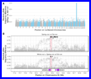][alle_freqs]


## `r make_link("003-extract-johnson-creek-variants.Rmd")`

Use the previously assembled Chinook genome from @narumGenomicVariationUnderlying2018
to ascertain variation from that Upper Columbia River summer/spring run fish
around the GREB1L region.  The products of this analysis go into some later trees and
haplotype rasters.

## `r make_link("004-prepare-haplotypes.Rmd")`

Using BEAGLE to impute genotypes and infer haplotypes in 5 Mb around GREB1L.
The outputs of this analysis are used for a number of downstream analyses.

## `r make_link("005-annotating-variants-near-greb1l.Rmd")`

Using snpEff to annotate variants and then analyzing a few of them.  This
provides data that goes into Table S1 ("Two near-perfectly associated, non-synonymous variants in the GREB1L gene"),
and is also used later for the haplotype raster plots.

[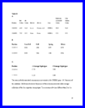][snpeff_res]

## `r make_link("006-haplo-raster-plots.Rmd")`

Compiling some auxiliary information (gene/exon inclusion, etc.) and
then making haplotype raster plots using functions from the
'ecaRbioinf' package.

[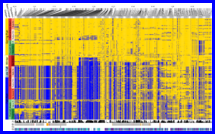][haplo_raster]
[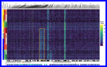][read_depth_raster]

## `r make_link("007-arg-inference-and-plotting.Rmd")`

Use RENT+ [@mirzaei2016rentplus] to infer the ancestral recombination graph in the
RoSA and plot it with a tree/heatmap, using ggtree [@yuGgtreePackageVisualization2017].

[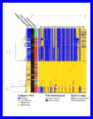][arg_tree]

## `r make_link("008-read-depths-and-duplications.Rmd")`

Using bedtools to compute read depths from the BAMs and then demonstrate that
the apparent duplications are highly associated with run type.

[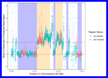][agg_read_depths]
[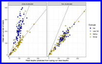][indiv_rd_scatter]


## `r make_link("009-rosa-dna-distance-trees.Rmd")`

Making distance trees between haplotypes in the RoSA region, and including
coho salmon.

[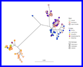][unrooted_chinook]
[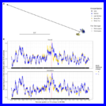][coho_chinook_tree_smooth]

## `r make_link("010-salmon-river-carcasses.Rmd")`

Genotype frequency, spatial and temporal analyses of RoSA genotypes of post-spawn
Salmon River carcasses.  Data from here also go into Table S7
("Summary of number of Salmon River Chinook salmon carcasses and their RoSA genotypes").

[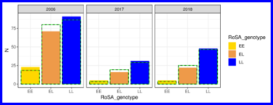][hwe_counts]
[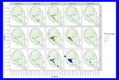][carcass_maps_2006]
[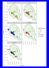][carcass_maps_all_years]
[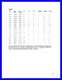][carcass_table]

## `r make_link("011-recombinant-frequencies.Rmd")`

Determining frequencies of recombinant haplotypes between the RoSA region and the
imperfectly associated SNPs reported in @princeEvolutionaryBasisPremature2017.  
Data from this RMarkdown document go into Table S9
("Frequencies of haplotypes recombinant/non-recombinant
between the distal and RoSA region in collections from California and Oregon").

[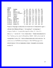][recomb_table]

## `r make_link("012-coalescent-modeling-of-recombinants.Rmd")`

Performing discrete time coalescent-with-recombination simulations to determine the
likelihood of seeing such a high recombinant frequency in the Iron Gate Hatchery
if spring-fall introgression only occurred after human modifications to the watershed.

[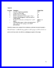][recomb_sim_params]
[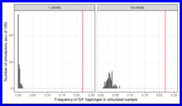][recomb_sims]


## `r make_link("100-RoSA-figure1-map-using-sf.Rmd")`

Making the map for Figure 1.

[][fig1map]


## `r make_link("101-Klamath-estuary-GSI-rubias.Rmd")`

Genetic stock identification of Chinook salmon caught in the Klamath
River estuary.

## `r make_link("102-Klamath-estuary-ANOVA-sampling-date-RoSA.Rmd")`

[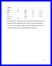][anova_table]


## `r make_link("103-Klamath-estuary-GonadSI-mixed-model-analysis.Rmd")`

[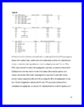][mm_results]


## `r make_link("103.1-Klamath-estuary-GonadSI-power-analysis.Rmd")`


## `r make_link("104-Klamath-estuary-nonwaterfraction-adiposity-mixed-model-analysis.Rmd")`

[][mm_results]


## `r make_link("104.1-Klamath-estuary-nonwaterfraction-power-analysis.Rmd")`


## `r make_link("105-Klamath-estuary-figure4.Rmd")`

[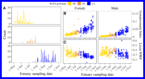][estgsifat]


## `r make_link("106-TrinityRiver-ANOVA-etc.Rmd")`

[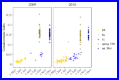][trh_gonad]
[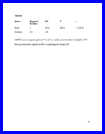][trh_anova]


## `r make_link("107-RoSA-population-genetics-survey.Rmd")`

[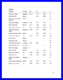][popgen]


## `r make_link("108-Klamath-basin-early-RoSA-haplotype-abundance-commercial-fishery-model-tableS10.Rmd")`

[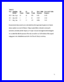][ocean_fishery]


## `r make_link("201-01-prep-bams-to-seek-inversions.Rmd")`

## `r make_link("201-02-seek-inversions.Rmd")`

## `r make_link("201-03-seek-inversions-with-gridss.Rmd")`

## `r make_link("202-01-genomewide-allele-freqs-from-the-bams.Rmd")`

## `r make_link("203-01-pca-for-gwas-covariate.Rmd")`

## `r make_link("203-02-gwas-with-angsd.Rmd")`

## `r make_link("204-01-assess-genotyping-error-rate-with-whoa.Rmd")`

## `r make_link("204-02-assess-genotype-error-from-subsampled-hi-read-depth-samples.Rmd")`

## `r make_link("204-03-simulate-imputation-and-phasing-error-for-trees.Rmd")`


[haplo_raster]: `r hdir`images_and_thumbs/moderate-zoom-haplo-raster-with-JC-fish.pdf
[read_depth_raster]: `r hdir`images_and_thumbs/read-depth-raster.pdf
[alle_freqs]: `r hdir`images_and_thumbs/allele-freqs-figure.pdf
[snpeff_res]: `r hdir`images_and_thumbs/table-s2-2-candidate-snps.pdf
[arg_tree]: `r hdir`images_and_thumbs/ultra-heatmap-chopped.pdf
[agg_read_depths]: `r hdir`images_and_thumbs/aggregate-read-depth-lines.pdf
[indiv_rd_scatter]: `r hdir`images_and_thumbs/individual-read-depth-scatters.pdf
[unrooted_chinook]: `r hdir`images_and_thumbs/chinook-only-unrooted-tree-Johnson-Ck.pdf
[coho_chinook_tree_smooth]: `r hdir`images_and_thumbs/coho-tree-and-smooth.pdf
[hwe_counts]: `r hdir`images_and_thumbs/salmon-river_hwe_counts-3-panel.pdf
[carcass_maps_2006]: `r hdir`images_and_thumbs/salmon-river-spatiotemporal-map-2006.pdf
[carcass_maps_all_years]: `r hdir`images_and_thumbs/salmon-river-map-all-years-faceted-by-geno.pdf
[carcass_table]: `r hdir`images_and_thumbs/table-s7-carcasses.pdf
[recomb_table]: `r hdir`images_and_thumbs/table-s9-recombinant-freqs.pdf
[recomb_sims]: `r hdir`images_and_thumbs/prince-rosa-recomb-histos.pdf
[fig1map]: `r hdir`images_and_thumbs/figure-1-map.pdf
[anova_table]: `r hdir`images_and_thumbs/table-s4-freshwater-anova.pdf
[mm_results]: `r hdir`images_and_thumbs/table-s5-mm-results.pdf
[estgsifat]: `r hdir`images_and_thumbs/RoSA_figure4_multipanel_estuary_gonadsi_fatness.pdf
[trh_anova]: `r hdir`images_and_thumbs/table-s6-trh-anova.pdf
[trh_gonad]: `r hdir`images_and_thumbs/trh-gsi-plot.pdf
[popgen]: `r hdir`images_and_thumbs/table-s8-pop-gen-survey.pdf
[recomb_sim_params]: `r hdir`images_and_thumbs/table-s10-recom-sim-params.pdf
[ocean_fishery]: `r hdir`images_and_thumbs/table-s11-ocean-fishery-freqs.pdf

## References
