Thompson et. al. 2020, Data and Code Repository
================
Neil F. Thompson, Eric C. Anderson, Anthony Clemento, Matthew Campbell,
Devon E. Pearse, James Hearsey, Andrew P. Kinziger, John Carlos Garza

**Last Updated:**
2020-05-15

[](https://zenodo.org/badge/latestdoi/263405637)

This repository includes code, data, and some intermediate results to
reproduce the results in Thompson et al. (“A complex phenotype in salmon
controlled by a simple change in migratory timing”). You can get the
whole thing by cloning or downloading the repo from
<https://github.com/eriqande/thompson-et-al-2020-chinook-salmon-migration-timing>.

If you are viewing this as the README of a GitHub repository, note that
you can read it in a somewhat friendlier format (i.e., with a table of
contents, etc.) on GitHub pages at:
<https://eriqande.github.io/thompson-et-al-2020-chinook-salmon-migration-timing/>

For the whole-genome resequencing data, the production of BAMs and VCFs
from the original FASTQ files follows a standard bwa/GATK pipeline as
described in the supplemental methods. Here we focus on analyses of the
products of that work. The various steps are described in a series of
RMarkdown documents with a fair bit of explanation/description of the
procedures. Analyses requiring the use of cluster computing resources
are described and documented, but will not be run automatically by
evaluating the RMarkdown document. Implementing them yourself will
require modification for the vagaries of your own high performance
computing system and preferred mode of parallelization, etc. Running
some of the RMarkdown documents requires a proper shell. These were
initially developed and run on a Mac. They have also been tested and
confirmed to run on a server running CentOs 7.

Rmarkdown documents in the 000 series were developed primarily by Eric
C. Anderson. Rmarkdown documents in the 100 series were developed
primarily by Neil F. Thompson. Rmarkdown documents in the 200 series
were developed primarily by Eric C. Anderson and deal with further
analyses done to respond to several reviewer queries.

In most cases, products from cluster computing are placed in this
repository within the `stored_results` directory. This means that all
the RMarkdown documents can be evaluated successfully without first
running the cluster-based analyses, except for
`002-allele-frequencies.Rmd`, for which the products from the
cluster-based analyses require too much space to store in this
repository. Fortunately, none of the downstream analyses depend upon the
outputs from `002-allele-frequencies.Rmd`.

All the RMarkdown documents can be evaluated en masse (except for
`002-allele-frequencies.Rmd`) by sourcing the R script
`render-numbered-Rmds.R`. On a fairly old mac laptop the run times for
each are as follows. Note that this does not include the time required
to create the stored results on the cluster,
etc.

| Rmarkdown document                                                                     | Run time  |
| -------------------------------------------------------------------------------------- | --------- |
| 001-align-coho-genome.Rmd                                                              | 1.7 secs  |
| 002-allele-frequencies.Rmd (after running initial results on cluster)                  | 3.3 mins  |
| 003-extract-johnson-creek-variants.Rmd                                                 | 8.7 mins  |
| 004-prepare-haplotypes.Rmd                                                             | 11.2 mins |
| 005-annotating-variants-near-greb1l.Rmd                                                | 5.9 mins  |
| 006-haplo-raster-plots.Rmd                                                             | 1.2 mins  |
| 007-arg-inference-and-plotting.Rmd                                                     | 4.9 mins  |
| 008-read-depths-and-duplications.Rmd                                                   | 41.2 secs |
| 009-rosa-dna-distance-trees.Rmd                                                        | 2.3 mins  |
| 010-salmon-river-carcasses.Rmd                                                         | 48.2 secs |
| 011-recombinant-frequencies.Rmd                                                        | 1.5 mins  |
| 012-coalescent-modeling-of-recombinants.Rmd                                            | 3.5 mins  |
| 100-RoSA-figure1-map.Rmd                                                               | 16.4 secs |
| 101-Klamath-estuary-GSI-rubias.Rmd                                                     | 18.0 secs |
| 102-Klamath-estuary-ANOVA-sampling-date-RoSA.Rmd                                       | 11.0 secs |
| 102.1-Klamath-estuary-partial-correlation.Rmd                                          | 1.6 secs  |
| 103-Klamath-estuary-GonadSI-mixed-model-analysis.Rmd                                   | 3.3 secs  |
| 103.1-Klamath-estuary-GonadSI-power-analysis.Rmd                                       | 1.4 mins  |
| 104-Klamath-estuary-nonwaterfraction-adiposity-mixed-model-analysis.Rmd                | 2.1 secs  |
| 104.1-Klamath-estuary-nonwaterfraction-power-analysis.Rmd                              | 1.7 mins  |
| 105-Klamath-estuary-figure4.Rmd                                                        | 7.7 secs  |
| 106-TrinityRiver-ANOVA-etc.Rmd                                                         | 9.5 secs  |
| 107-RoSA-population-genetics-survey.Rmd                                                | 1.6 secs  |
| 108-Klamath-basin-early-RoSA-haplotype-abundance-commercial-fishery-model-tableS10.Rmd | 1.2 secs  |
| 201-01-prep-bams-to-seek-inversions.Rmd                                                | 0.16 secs |
| 201-02-seek-inversions.Rmd                                                             | 3.7 mins  |
| 201-03-seek-inversions-with-gridss.Rmd                                                 | 4.0 secs  |
| 202-01-genomewide-allele-freqs-from-the-bams.Rmd                                       | 4.7 secs  |
| 203-01-pca-for-gwas-covariate.Rmd                                                      | 4.7 secs  |
| 203-02-gwas-with-angsd.Rmd                                                             | 4.4 mins  |
| 204-01-assess-genotyping-error-rate-with-whoa.Rmd                                      | 1.2 mins  |
| 204-02-assess-genotype-error-from-subsampled-hi-read-depth-samples.Rmd                 | 2.0 mins  |
| 204-03-simulate-imputation-and-phasing-error-for-trees.Rmd                             | 6.7 mins  |

# Preliminaries and Dependencies

Below is a description of the needed dependencies. A script to install
all of them on one of our test clusters is at
`000-00-prepare-dependencies.sh`, but it will likely need some tweaking
on your system.

## Genomes, etc.

Download the necessary Chinook and coho genomes and put them in a new
directory called `genome` in this repository. Index them with samtools
faidx.

``` sh
mkdir genome
cd genome

# coho genome
wget ftp://ftp.ncbi.nlm.nih.gov/genomes/all/GCF/002/021/735/GCF_002021735.1_Okis_V1/GCF_002021735.1_Okis_V1_genomic.fna.gz
mv GCF_002021735.1_Okis_V1_genomic.fna.gz Okis_V1_genomic.fna.gz
gunzip Okis_V1_genomic.fna.gz 
samtools faidx Okis_V1_genomic.fna


# chinook genome
wget ftp://ftp.ncbi.nlm.nih.gov/genomes/all/GCF/002/872/995/GCF_002872995.1_Otsh_v1.0/GCF_002872995.1_Otsh_v1.0_genomic.fna.gz
mv GCF_002872995.1_Otsh_v1.0_genomic.fna.gz Otsh_V1_genomic.fna.gz
gunzip Otsh_V1_genomic.fna.gz 
samtools faidx Otsh_V1_genomic.fna

# chinook genome GFF
wget ftp://ftp.ncbi.nlm.nih.gov/genomes/all/GCF/002/872/995/GCF_002872995.1_Otsh_v1.0/GCF_002872995.1_Otsh_v1.0_genomic.gff.gz

# Narum et al. version of Chinook genome from the Johnson Creek fish
wget ftp://ftp.ncbi.nlm.nih.gov/genomes/genbank/vertebrate_other/Oncorhynchus_tshawytscha/all_assembly_versions/GCA_002831465.1_CHI06/GCA_002831465.1_CHI06_genomic.fna.gz
gunzip GCA_002831465.1_CHI06_genomic.fna.gz
samtools faidx GCA_002831465.1_CHI06_genomic.fna

cd ../
```

## Geospatial data

Make a directory in the top level of the repository called `geo-spatial`
and then put some things in there:

1.  Get CalWater2.2.1 by going to
    <https://drive.google.com/file/d/13WqsA3jK1C0kW5zaznEwDkg3wBc-cBco/view>
    and then choosing the Google Drive download button to download a
    whole zip file that expands into a directory named
    `GISlayers_calw221_shp`. Move or symlink that whole directory inside
    `geo-spatial`. These are watershed boundaries.

2.  Get California stream line data from
    <http://data-cdfw.opendata.arcgis.com/datasets/29c40f65341749b3aa26d3f0e09502b9_4.zip>.
    Unzip that directory into one called `California_Streams` and move
    or symlink that directory into `geo-spatial`.

3.  Download some things from Natural Earth Data:
    
      - Natural Earth II with Shaded Relief, Water, and Drainages raster
        <https://www.naturalearthdata.com/http//www.naturalearthdata.com/download/10m/raster/NE2_HR_LC_SR_W_DR.zip>.
        Put or symlink the resulting directory, `NE2_HR_LC_SR_W_DR` into
        `geo-spatial`.
      - 10m-cultural-vectors, Admin 1 – States, Provinces, Download
        boundary lines:
        <https://www.naturalearthdata.com/http//www.naturalearthdata.com/download/10m/cultural/ne_10m_admin_1_states_provinces_lines.zip>.
        Put or symlink the resulting directory,
        `ne_10m_admin_1_states_provinces_lines` into `geo-spatial`.
      - Finally, get the coastlines:
        <https://www.naturalearthdata.com/http//www.naturalearthdata.com/download/10m/physical/ne_10m_coastline.zip>,
        and put the resulting folder, `ne_10m_coastline` into
        `geo-spatial`.

## Unix Programs

The following programs must be installed and available in the PATH.
Versions used on Eric’s laptop appear in parentheses.

  - [`angsd`](http://www.popgen.dk/angsd/index.php/ANGSD) (Version:
    0.920, using htslib: 1.6)

  - [`bwa`](https://github.com/lh3/bwa) (Version: 0.7.16a-r1181)

  - [`samtools`](http://www.htslib.org/) (Version: 1.3, using htslib
    1.3)

  - [`bcftools`](http://www.htslib.org/) (Version: 1.9, using htslib
    1.9)

  - [`bgzip`, `tabix`](http://www.htslib.org/) (Version 1.6) These are
    found within the htslib library.

  - [`vcftools`](https://vcftools.github.io/index.html) (Version
    v0.1.12b)

  - [`bedtools`](https://bedtools.readthedocs.io/en/latest/) (Version
    v2.27.1)

  - [`PHASE`](http://stephenslab.uchicago.edu/phase/download.html)
    (Version 2.1.1)

  - [`lastz`](http://www.bx.psu.edu/~rsharris/lastz/) (Version 1.04)
    This was obtained and compiled thus:
    
    ``` sh
    wget http://www.bx.psu.edu/~rsharris/lastz/lastz-1.04.03.tar.gz
    gunzip lastz-1.04.03.tar.gz
    tar -xvf lastz-1.04.03.tar
    cd lastz-distrib-1.04.03/
    make
    make install
    ```

  - [`maf2fasta`,
    `single_cov2`](http://www.bx.psu.edu/miller_lab/dist/multiz-tba.012109.tar.gz)
    (From `multiz` Version 012109) Obtain and compile like this:
    
    ``` sh
    wget http://www.bx.psu.edu/miller_lab/dist/multiz-tba.012109.tar.gz
    gunzip multiz-tba.012109.tar.gz
    tar -xvf multiz-tba.012109.tar
    cd multiz-tba.012109/
    make
    ```

## Java jars

The following Java-based programs must be downloaded, and the paths to
their associated Jar files must be listed appropriately in the file
`script/java-jar-paths.R`:

  - [`BEAGLE`](https://faculty.washington.edu/browning/beagle/b4_1.html).
    (Version 4.1) The version here is important. Don’t use version 5.
  - [`RentPlus`](https://github.com/SajadMirzaei/RentPlus) (Version
    v0.5)

The distributed version of `script/java-jar-paths.R` reflects the
placement of Jar files on Eric’s system:

``` sh
# central place in repository to store paths for Java Jar files we use

BEAGLE=/Users/eriq/Documents/others_code/BEAGLE_4.1/beagle.27Jan18.7e1.jar
RentPlus=/Users/eriq/Documents/others_code/RentPlus/RentPlus.jar
```

This should be updated to reflect where you have stored the jar files on
your system.

One more Java program—snpEff—is required. The installation procedure for
this is slightly different, owing to it needing to store data bases in
the directory where the Jar file resides (apparently).

So,

1.  Download
    [`snpEff`](https://sourceforge.net/projects/snpeff/files/snpEff_v4_3t_core.zip/download)
    The link provided is for Version 4.3 with a release date of 24
    November 2017. THis is the version we used.
2.  Expand that zip archive and move the resulting directory into  
    the top level of this repository. When you are done, you should be
    able to `ls` the Jar file like this:

<!-- end list -->

``` sh
ls snpEff_v4_3t_core/snpEff/snpEff.jar 
```

## R Packages

Packages must be downloaded from CRAN, BioConductor, and GitHub. The
following code, which is in `R/install_packages_etc.R`, will download
and install the necessary packages:

``` r
# just R code to install the packages needed for running the notebooks

# get the packages needed from CRAN
install.packages(
  c(
    "ape",
    "broom",
    "callr",
    "car",
    "cowplot",
    "ggsn",
    "ggspatial",
    "kableExtra",
    "knitr",
    "lubridate",
    "maps",
    "mapproj",
    "nlme",
    "pander",
    "parallel",
    "phangorn",
    "plotly",
    "ppcor",
    "raster",
    "remotes",
    "rmarkdown",
    "rubias",
    "sessioninfo",
    "sf",
    "sjPlot",
    "tidyverse",
    "vcfR",
    "viridis",
    "whoa",
    "zoo"
  ),
  repos = "http://cran.rstudio.com"
)

# Note that, on the cluster, since I don't have admin access,
# I needed to get the sysadmin to get rgdal installed and to
# install libudunits2.so in order to complete the install of:
# units, rgdal, sf, rosm, lwgeom, ggsn, ggspatial


# get the packages needed from BioConductor
if (!requireNamespace("BiocManager", quietly = TRUE)) {
  install.packages("BiocManager", repos = "http://cran.rstudio.com")
}

BiocManager::install("ggtree")
BiocManager::install("treeio")


# Get package ecaRbioinf at https://github.com/eriqande/ecaRbioinf
# This is a package of useful functions by Eric C. Anderson. We
# used commit `6972defd`.  Get it like this:
remotes::install_github("eriqande/ecaRbioinf", ref = "6972defd")
```

# RMarkdown Documents

The following RMarkdown documents should be evaluated in order. The
script `render-numbered-Rmds.R` will do that (except for
`002-allele-frequencies.Rmd`) when run in the top level of this
repository. Some RMarkdown documents rely on outputs from previous ones.
Some of these RMarkdown documents include calls to Unix utilities, so
might not run on non-Unix or non-Linux architectures.

Outputs (figures, tables, R data objects, etc) from each RMarkdown
document are written to the `outputs/XXX` directories. Intermediate
files written during evaluation of each RMarkdown document are written
to the `intermediates/XXX` directories. To facilitate working between
the cluster and a desktop/laptop, some outputs are written to the
`stored_results/XXX` directories which are version controlled and
included in this repo.

Thumbnails of the figures and tables generated by each RMarkdown
document appear below. Additionally, at the top of each section is a
link to the compiled (HTML-version) of the RMarkdown document on GitHub
Pages.

## 001-align-coho-genome.Rmd

(*Compiled RMarkdown HTML document on GitHub Pages:*
[001-align-coho-genome.html](https://eriqande.github.io/thompson-et-al-2020-chinook-salmon-migration-timing/001-align-coho-genome.html))

The products of this analysis go into creation of some of the trees
(`009`) and also in the designation of the alleles as ancestral or not
in some of the haplotype rasters (`006`).

## 002-allele-frequencies.Rmd

(*Compiled RMarkdown HTML document on GitHub Pages:*
[002-allele-frequencies.html](https://eriqande.github.io/thompson-et-al-2020-chinook-salmon-migration-timing/002-allele-frequencies.html))

Calculation of allele frequency differences between early- and
late-running forms across the genome, and around GREB1L, and the
generation of
plots.

[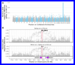](https://eriqande.github.io/thompson-et-al-2020-chinook-salmon-migration-timing/images_and_thumbs/allele-freqs-figure.pdf)

## 003-extract-johnson-creek-variants.Rmd

(*Compiled RMarkdown HTML document on GitHub Pages:*
[003-extract-johnson-creek-variants.html](https://eriqande.github.io/thompson-et-al-2020-chinook-salmon-migration-timing/003-extract-johnson-creek-variants.html))

Using the previously assembled Chinook salmon genome from Narum et al.
(2018) to ascertain variation from that Upper Columbia River
summer/spring-run fish around the GREB1L region. The products of this
analysis go into some later trees and haplotype rasters.

## 004-prepare-haplotypes.Rmd

(*Compiled RMarkdown HTML document on GitHub Pages:*
[004-prepare-haplotypes.html](https://eriqande.github.io/thompson-et-al-2020-chinook-salmon-migration-timing/004-prepare-haplotypes.html))

Using BEAGLE to impute genotypes and infer haplotypes in 5 Mb around
GREB1L. The outputs of this analysis are used for a number of downstream
analyses.

## 005-annotating-variants-near-greb1l.Rmd

(*Compiled RMarkdown HTML document on GitHub Pages:*
[005-annotating-variants-near-greb1l.html](https://eriqande.github.io/thompson-et-al-2020-chinook-salmon-migration-timing/005-annotating-variants-near-greb1l.html))

Using snpEff to annotate variants and then analyzing a few of them. This
provides data that goes into Table S1 (“Two near-perfectly associated,
non-synonymous variants in the GREB1L gene”), and is also used later for
the haplotype raster
plots.

[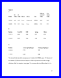](https://eriqande.github.io/thompson-et-al-2020-chinook-salmon-migration-timing/images_and_thumbs/table-s2-2-candidate-snps.pdf)

## 006-haplo-raster-plots.Rmd

(*Compiled RMarkdown HTML document on GitHub Pages:*
[006-haplo-raster-plots.html](https://eriqande.github.io/thompson-et-al-2020-chinook-salmon-migration-timing/006-haplo-raster-plots.html))

Compiling some auxiliary information (gene/exon inclusion, etc.) and
then making haplotype raster plots using functions from the ‘ecaRbioinf’
package.

[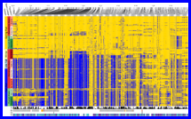](https://eriqande.github.io/thompson-et-al-2020-chinook-salmon-migration-timing/images_and_thumbs/moderate-zoom-haplo-raster-with-JC-fish.pdf)
[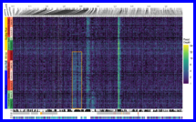](https://eriqande.github.io/thompson-et-al-2020-chinook-salmon-migration-timing/images_and_thumbs/read-depth-raster.pdf)

## 007-arg-inference-and-plotting.Rmd

(*Compiled RMarkdown HTML document on GitHub Pages:*
[007-arg-inference-and-plotting.html](https://eriqande.github.io/thompson-et-al-2020-chinook-salmon-migration-timing/007-arg-inference-and-plotting.html))

Using RENT+ (Mirzaei and Wu 2016) to infer the ancestral recombination
graph in the RoSA and plot it with a tree/heatmap, using ggtree (Yu et
al.
2017).

[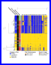](https://eriqande.github.io/thompson-et-al-2020-chinook-salmon-migration-timing/images_and_thumbs/ultra-heatmap-chopped.pdf)

## 008-read-depths-and-duplications.Rmd

(*Compiled RMarkdown HTML document on GitHub Pages:*
[008-read-depths-and-duplications.html](https://eriqande.github.io/thompson-et-al-2020-chinook-salmon-migration-timing/008-read-depths-and-duplications.html))

Using bedtools to compute read depths from the BAMs and then demonstrate
that the apparent duplications are highly associated with run
type.

[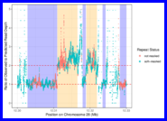](https://eriqande.github.io/thompson-et-al-2020-chinook-salmon-migration-timing/images_and_thumbs/aggregate-read-depth-lines.pdf)
[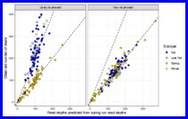](https://eriqande.github.io/thompson-et-al-2020-chinook-salmon-migration-timing/images_and_thumbs/individual-read-depth-scatters.pdf)

## 009-rosa-dna-distance-trees.Rmd

(*Compiled RMarkdown HTML document on GitHub Pages:*
[009-rosa-dna-distance-trees.html](https://eriqande.github.io/thompson-et-al-2020-chinook-salmon-migration-timing/009-rosa-dna-distance-trees.html))

Making distance trees between haplotypes in the RoSA region, and
including coho
salmon.

[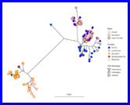](https://eriqande.github.io/thompson-et-al-2020-chinook-salmon-migration-timing/images_and_thumbs/chinook-only-unrooted-tree-Johnson-Ck.pdf)
[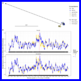](https://eriqande.github.io/thompson-et-al-2020-chinook-salmon-migration-timing/images_and_thumbs/coho-tree-and-smooth.pdf)

## 010-salmon-river-carcasses.Rmd

(*Compiled RMarkdown HTML document on GitHub Pages:*
[010-salmon-river-carcasses.html](https://eriqande.github.io/thompson-et-al-2020-chinook-salmon-migration-timing/010-salmon-river-carcasses.html))

Genotype frequency, spatial and temporal analyses of RoSA genotypes of
post-spawn Salmon River carcasses. Data from here also go into Table S7
(“Summary of number of Salmon River Chinook salmon carcasses and their
RoSA
genotypes”).

[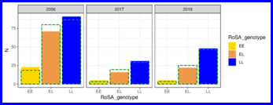](https://eriqande.github.io/thompson-et-al-2020-chinook-salmon-migration-timing/images_and_thumbs/salmon-river_hwe_counts-3-panel.pdf)
[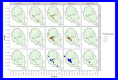](https://eriqande.github.io/thompson-et-al-2020-chinook-salmon-migration-timing/images_and_thumbs/salmon-river-spatiotemporal-map-2006.pdf)
[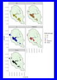](https://eriqande.github.io/thompson-et-al-2020-chinook-salmon-migration-timing/images_and_thumbs/salmon-river-map-all-years-faceted-by-geno.pdf)
[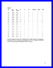](https://eriqande.github.io/thompson-et-al-2020-chinook-salmon-migration-timing/images_and_thumbs/table-s7-carcasses.pdf)

## 011-recombinant-frequencies.Rmd

(*Compiled RMarkdown HTML document on GitHub Pages:*
[011-recombinant-frequencies.html](https://eriqande.github.io/thompson-et-al-2020-chinook-salmon-migration-timing/011-recombinant-frequencies.html))

Determining frequencies of recombinant haplotypes between the RoSA
region and the imperfectly associated SNPs reported in Prince et al.
(2017). Data from this RMarkdown document go into Table S9 (“Frequencies
of haplotypes recombinant/non-recombinant between the distal and RoSA
region in collections from California and
Oregon”).

[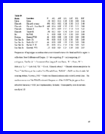](https://eriqande.github.io/thompson-et-al-2020-chinook-salmon-migration-timing/images_and_thumbs/table-s9-recombinant-freqs.pdf)

## 012-coalescent-modeling-of-recombinants.Rmd

(*Compiled RMarkdown HTML document on GitHub Pages:*
[012-coalescent-modeling-of-recombinants.html](https://eriqande.github.io/thompson-et-al-2020-chinook-salmon-migration-timing/012-coalescent-modeling-of-recombinants.html))

Performing discrete-time, coalescent-with-recombination simulations to
determine whether we expect to see such a high recombinant frequency in
the Klamath River — Iron Gate Hatchery collection if spring-fall
introgression only occurred after human modifications to the
watershed.

[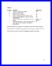](https://eriqande.github.io/thompson-et-al-2020-chinook-salmon-migration-timing/images_and_thumbs/table-s10-recom-sim-params.pdf)
[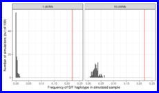](https://eriqande.github.io/thompson-et-al-2020-chinook-salmon-migration-timing/images_and_thumbs/prince-rosa-recomb-histos.pdf)

## 100-RoSA-figure1-map-using-sf.Rmd

(*Compiled RMarkdown HTML document on GitHub Pages:*
[100-RoSA-figure1-map-using-sf.html](https://eriqande.github.io/thompson-et-al-2020-chinook-salmon-migration-timing/100-RoSA-figure1-map-using-sf.html))

Making the map for Figure
1.

[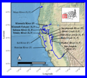](https://eriqande.github.io/thompson-et-al-2020-chinook-salmon-migration-timing/images_and_thumbs/figure-1-map.pdf)

## 101-Klamath-estuary-GSI-rubias.Rmd

(*Compiled RMarkdown HTML document on GitHub Pages:*
[101-Klamath-estuary-GSI-rubias.html](https://eriqande.github.io/thompson-et-al-2020-chinook-salmon-migration-timing/101-Klamath-estuary-GSI-rubias.html))

Genetic stock identification of Chinook salmon caught in the Klamath
River estuary.

## 102-Klamath-estuary-ANOVA-sampling-date-RoSA.Rmd

(*Compiled RMarkdown HTML document on GitHub Pages:*
[102-Klamath-estuary-ANOVA-sampling-date-RoSA.html](https://eriqande.github.io/thompson-et-al-2020-chinook-salmon-migration-timing/102-Klamath-estuary-ANOVA-sampling-date-RoSA.html))

[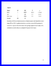](https://eriqande.github.io/thompson-et-al-2020-chinook-salmon-migration-timing/images_and_thumbs/table-s4-freshwater-anova.pdf)

## 103-Klamath-estuary-GonadSI-mixed-model-analysis.Rmd

(*Compiled RMarkdown HTML document on GitHub Pages:*
[103-Klamath-estuary-GonadSI-mixed-model-analysis.html](https://eriqande.github.io/thompson-et-al-2020-chinook-salmon-migration-timing/103-Klamath-estuary-GonadSI-mixed-model-analysis.html))

[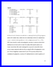](https://eriqande.github.io/thompson-et-al-2020-chinook-salmon-migration-timing/images_and_thumbs/table-s5-mm-results.pdf)

## 103.1-Klamath-estuary-GonadSI-power-analysis.Rmd

(*Compiled RMarkdown HTML document on GitHub Pages:*
[103.1-Klamath-estuary-GonadSI-power-analysis.html](https://eriqande.github.io/thompson-et-al-2020-chinook-salmon-migration-timing/103.1-Klamath-estuary-GonadSI-power-analysis.html))

## 104-Klamath-estuary-nonwaterfraction-adiposity-mixed-model-analysis.Rmd

(*Compiled RMarkdown HTML document on GitHub Pages:*
[104-Klamath-estuary-nonwaterfraction-adiposity-mixed-model-analysis.html](https://eriqande.github.io/thompson-et-al-2020-chinook-salmon-migration-timing/104-Klamath-estuary-nonwaterfraction-adiposity-mixed-model-analysis.html))

[](https://eriqande.github.io/thompson-et-al-2020-chinook-salmon-migration-timing/images_and_thumbs/table-s5-mm-results.pdf)

## 104.1-Klamath-estuary-nonwaterfraction-power-analysis.Rmd

(*Compiled RMarkdown HTML document on GitHub Pages:*
[104.1-Klamath-estuary-nonwaterfraction-power-analysis.html](https://eriqande.github.io/thompson-et-al-2020-chinook-salmon-migration-timing/104.1-Klamath-estuary-nonwaterfraction-power-analysis.html))

## 105-Klamath-estuary-figure4.Rmd

(*Compiled RMarkdown HTML document on GitHub Pages:*
[105-Klamath-estuary-figure4.html](https://eriqande.github.io/thompson-et-al-2020-chinook-salmon-migration-timing/105-Klamath-estuary-figure4.html))

[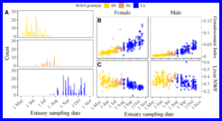](https://eriqande.github.io/thompson-et-al-2020-chinook-salmon-migration-timing/images_and_thumbs/RoSA_figure4_multipanel_estuary_gonadsi_fatness.pdf)

## 106-TrinityRiver-ANOVA-etc.Rmd

(*Compiled RMarkdown HTML document on GitHub Pages:*
[106-TrinityRiver-ANOVA-etc.html](https://eriqande.github.io/thompson-et-al-2020-chinook-salmon-migration-timing/106-TrinityRiver-ANOVA-etc.html))

[](https://eriqande.github.io/thompson-et-al-2020-chinook-salmon-migration-timing/images_and_thumbs/trh-gsi-plot.pdf)
[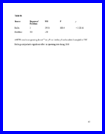](https://eriqande.github.io/thompson-et-al-2020-chinook-salmon-migration-timing/images_and_thumbs/table-s6-trh-anova.pdf)

## 107-RoSA-population-genetics-survey.Rmd

(*Compiled RMarkdown HTML document on GitHub Pages:*
[107-RoSA-population-genetics-survey.html](https://eriqande.github.io/thompson-et-al-2020-chinook-salmon-migration-timing/107-RoSA-population-genetics-survey.html))

[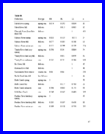](https://eriqande.github.io/thompson-et-al-2020-chinook-salmon-migration-timing/images_and_thumbs/table-s8-pop-gen-survey.pdf)

## 108-Klamath-basin-early-RoSA-haplotype-abundance-commercial-fishery-model-tableS10.Rmd

(*Compiled RMarkdown HTML document on GitHub Pages:*
[108-Klamath-basin-early-RoSA-haplotype-abundance-commercial-fishery-model-tableS10.html](https://eriqande.github.io/thompson-et-al-2020-chinook-salmon-migration-timing/108-Klamath-basin-early-RoSA-haplotype-abundance-commercial-fishery-model-tableS10.html))

[](https://eriqande.github.io/thompson-et-al-2020-chinook-salmon-migration-timing/images_and_thumbs/table-s11-ocean-fishery-freqs.pdf)

## 201-01-prep-bams-to-seek-inversions.Rmd

(*Compiled RMarkdown HTML document on GitHub Pages:*
[201-01-prep-bams-to-seek-inversions.html](https://eriqande.github.io/thompson-et-al-2020-chinook-salmon-migration-timing/201-01-prep-bams-to-seek-inversions.html))

## 201-02-seek-inversions.Rmd

(*Compiled RMarkdown HTML document on GitHub Pages:*
[201-02-seek-inversions.html](https://eriqande.github.io/thompson-et-al-2020-chinook-salmon-migration-timing/201-02-seek-inversions.html))

## 201-03-seek-inversions-with-gridss.Rmd

(*Compiled RMarkdown HTML document on GitHub Pages:*
[201-03-seek-inversions-with-gridss.html](https://eriqande.github.io/thompson-et-al-2020-chinook-salmon-migration-timing/201-03-seek-inversions-with-gridss.html))

## 202-01-genomewide-allele-freqs-from-the-bams.Rmd

(*Compiled RMarkdown HTML document on GitHub Pages:*
[202-01-genomewide-allele-freqs-from-the-bams.html](https://eriqande.github.io/thompson-et-al-2020-chinook-salmon-migration-timing/202-01-genomewide-allele-freqs-from-the-bams.html))

## 203-01-pca-for-gwas-covariate.Rmd

(*Compiled RMarkdown HTML document on GitHub Pages:*
[203-01-pca-for-gwas-covariate.html](https://eriqande.github.io/thompson-et-al-2020-chinook-salmon-migration-timing/203-01-pca-for-gwas-covariate.html))

## 203-02-gwas-with-angsd.Rmd

(*Compiled RMarkdown HTML document on GitHub Pages:*
[203-02-gwas-with-angsd.html](https://eriqande.github.io/thompson-et-al-2020-chinook-salmon-migration-timing/203-02-gwas-with-angsd.html))

## 204-01-assess-genotyping-error-rate-with-whoa.Rmd

(*Compiled RMarkdown HTML document on GitHub Pages:*
[204-01-assess-genotyping-error-rate-with-whoa.html](https://eriqande.github.io/thompson-et-al-2020-chinook-salmon-migration-timing/204-01-assess-genotyping-error-rate-with-whoa.html))

## 204-02-assess-genotype-error-from-subsampled-hi-read-depth-samples.Rmd

(*Compiled RMarkdown HTML document on GitHub Pages:*
[204-02-assess-genotype-error-from-subsampled-hi-read-depth-samples.html](https://eriqande.github.io/thompson-et-al-2020-chinook-salmon-migration-timing/204-02-assess-genotype-error-from-subsampled-hi-read-depth-samples.html))

## 204-03-simulate-imputation-and-phasing-error-for-trees.Rmd

(*Compiled RMarkdown HTML document on GitHub Pages:*
[204-03-simulate-imputation-and-phasing-error-for-trees.html](https://eriqande.github.io/thompson-et-al-2020-chinook-salmon-migration-timing/204-03-simulate-imputation-and-phasing-error-for-trees.html))

## References

<div id="refs" class="references">

<div id="ref-mirzaei2016rentplus">

Mirzaei, Sajad, and Yufeng Wu. 2016. “RENT+: An Improved Method for
Inferring Local Genealogical Trees from Haplotypes with Recombination.”
*Bioinformatics* 33 (7). Oxford University Press: 1021–30.

</div>

<div id="ref-narumGenomicVariationUnderlying2018">

Narum, Shawn R., Alex Di Genova, Steven J. Micheletti, and Alejandro
Maass. 2018. “Genomic Variation Underlying Complex Life-History Traits
Revealed by Genome Sequencing in Chinook Salmon.” *Proceedings of the
Royal Society B: Biological Sciences* 285 (1883): 20180935.
<https://doi.org/10.1098/rspb.2018.0935>.

</div>

<div id="ref-princeEvolutionaryBasisPremature2017">

Prince, Daniel J., Sean M. O’Rourke, Tasha Q. Thompson, Omar A. Ali,
Hannah S. Lyman, Ismail K. Saglam, Thomas J. Hotaling, Adrian P. Spidle,
and Michael R. Miller. 2017. “The Evolutionary Basis of Premature
Migration in Pacific Salmon Highlights the Utility of Genomics for
Informing Conservation.” *Science Advances* 3 (8): e1603198.
<https://doi.org/10.1126/sciadv.1603198>.

</div>

<div id="ref-yuGgtreePackageVisualization2017">

Yu, Guangchuang, David K. Smith, Huachen Zhu, Yi Guan, and Tommy
Tsan-Yuk Lam. 2017. “Ggtree: An R Package for Visualization and
Annotation of Phylogenetic Trees with Their Covariates and Other
Associated Data.” *Methods in Ecology and Evolution* 8 (1): 28–36.
<https://doi.org/10.1111/2041-210X.12628>.

</div>

</div>
